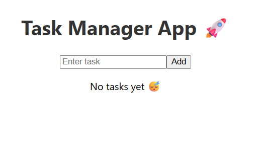

# 🚀 Task Manager App (MERN Stack)

A full-stack Task Manager application built using the MERN stack (MongoDB, Express, React, Node.js).
This app allows users to create, update, delete, and manage tasks efficiently.

---

## 🔥 Features

* ✅ Add new tasks
* 📝 Edit task title
* ✔️ Mark tasks as completed
* ❌ Delete tasks
* 🔄 Real-time updates (without page reload)
* 📦 REST API integration

---

## 🛠️ Tech Stack

**Frontend:**

* React.js
* CSS

**Backend:**

* Node.js
* Express.js

**Database:**

* MongoDB (Atlas)

---

## 📂 Project Structure

```
todo-app/
│
├── backend/
│   ├── server.js
│   ├── package.json
│   └── node_modules/
│
├── frontend/
│   ├── src/
│   │   ├── App.js
│   │   └── ...
│   ├── public/
│   └── package.json
│
└── README.md
```

---

## ⚙️ Installation & Setup

### 1️⃣ Clone the repository

```
git clone https://github.com/Madhumitha2312/todo-app-mern.git
cd todo-app
```

---

### 2️⃣ Setup Backend

```
cd backend
npm install
node server.js
```

---

### 3️⃣ Setup Frontend

```
cd frontend
npm install
npm start
```

---

## 🌐 API Endpoints

| Method | Endpoint   | Description     |
| ------ | ---------- | --------------- |
| GET    | /tasks     | Get all tasks   |
| POST   | /tasks     | Create new task |
| PUT    | /tasks/:id | Update task     |
| DELETE | /tasks/:id | Delete task     |

---

## 📸 Screenshots



---

## 🚀 Live Demo

Frontend: https://todo-app-mern3-qsz98hdl7-madhumithaprakash23-3241s-projects.vercel.app  
Backend: https://todo-app-mern-otg1.onrender.com/tasks

## 🎯 Future Improvements

* 🔍 Search tasks
* 📅 Due dates
* 🔐 User authentication
* 🎨 Improved UI

---

## 👩‍💻 Author

**Madhumitha**

---

## ⭐ Show your support

If you like this project, give it a ⭐ on GitHub!
